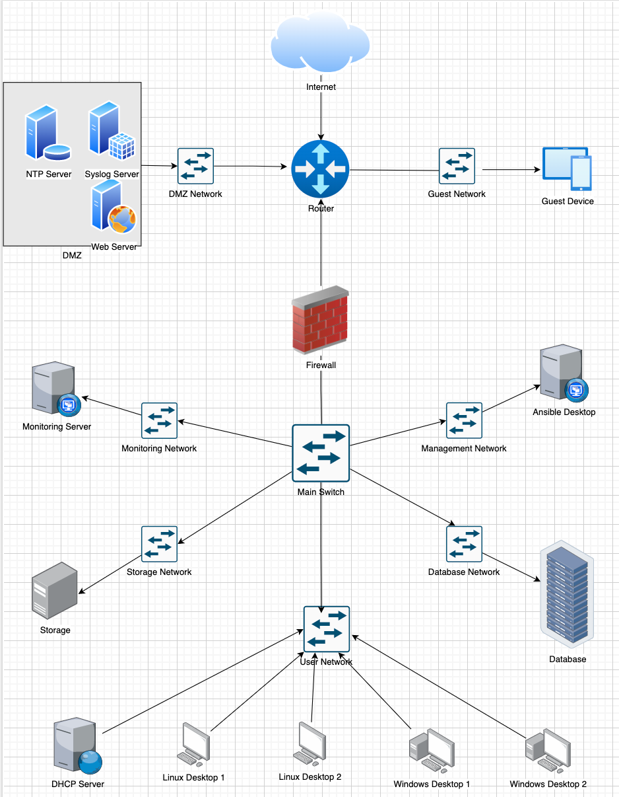

# Design and Deploy Network Infrastructures and System Standards

I designed this network with the aim of enhancing my understanding of fundamental services like DHCP, NTP, and Syslog, as well as diving into network security measures such as firewalls, ACLs, and port management. Additionally, I set out to gain hands-on experience with automation techniques across various devices, including Windows, Linux, switches, and routers.  
 
Implemented within a GNS3 lab environment, this project provided an opportunity for me to build upon my existing skills. Moreover, it is designed to accommodate individuals new to the field, making it an attainable undertaking for junior network engineers.  
  

  

  
  
The architecture of the network encompasses distinct zones: a perimeter zone, a dedicated DMZ with essential servers, a guest access zone, and a safeguarded internal zone secured by a firewall. The setup includes crucial components like a syslog server and NTP server within the perimeter, as well as a DHCP server, domain controller, and management desktops within the internal network to streamline operations.
  

This [project approval form](project-approval.md) encompasses an organizational overview, a network scope, and a comprehensive network diagram.
  

## 10 Test Case Scenarios

#### Test Case #1 Device Discovery and Reachability  
- Your network solution must include multiple network segments with access controls that allow traffic from a device on one network to access the resources of a device on another network. Similarly, there must be devices on one network that cannot access resources on a different network.

#### Test Case #2 Administering an Access Control List for Guest Access 
- Your network must utilize an Access Control List that allows guest access. Guest access should be limited to internet traffic only. 

#### Test Case #3 Security Compliance—Log-in Banners and Automation 
- Display a log-in banner when accessing each device on the network. The log-in banner should notify users of an acceptable use policy (AUP) or other security-based policies when attempting to log into the network. 
Additionally, establish an automated process to update the log-in banner for multiple devices. Clearly identify the devices that will be updated, and provide a step-by-step guide for initiating the automated updates. 

#### Test Case #4 Accessing External Resources—Routing and Traffic Security
- User devices on your network should have dynamic addresses that are assigned through DHCP unless they provide a service that requires a static address. You must also have at least one network resource that requires a static address. 

#### Test Case #5 Layer 2 Link Redundancy and Spanning-Tree Protocol (802.1w)
- Enable and manage the Spanning-Tree Protocol to establish redundant Layer 2 paths while avoiding possible loops and broadcast storms. Identify the Layer 2 devices that will become the Root Bridge. 
 
#### Test Case #6 Edge Device Syslog and NTP 
- Configure perimeter devices to generate system logs that capture unwanted traffic. Additionally, those perimeter devices should utilize Network Time Protocol (NTP) for clock synchronization. 
 
#### Test Case #7 Basic Network Segmentation at Layer 2 via VLANs and 802.1q
- Your network traffic should be segmented per department or service function at Layer 2 to enhance security and reduce network congestion at the switching layer while allowing segmented traffic to traverse between switches (VLAN trunking).  

#### Test Case #8 Basic or Advanced Networking  
- Identify devices on the network that allow for unsecured ports (port 23) Ensure that telnet is blocked if the port is open.

#### Test Case #9 Network Automation 
- Automate the backup of network device configurations on a weekly basis. Retrieve device configurations, and store them in a centralized location for easy access and disaster recovery.

#### Test Case #10 Network Security 
- Implement a networking monitoring tool that tracks network performance such as device statistics, link failures, high CPU utilization, or security breaches. Generate an alert for a specific event.
