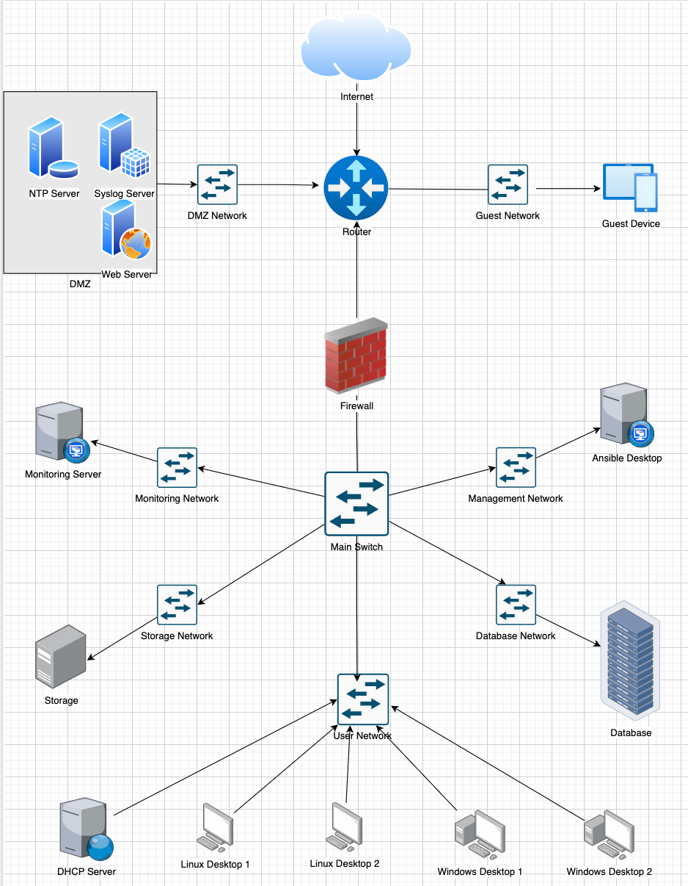

# Network Engineering Project Approval Form

## Introduction
Complete this project approval form by identifying the organizational overview, network scope, and network diagram for your proposed network project. Additionally, review the seven predefined test case scenarios and define three custom test cases to be validated against your network project. Your project will be built inside of a virtual lab environment using GNS3. It is recommended to explore the virtual lab environment and included GNS3 tools during the planning process to ensure alignment between the proposed network project and the available virtual networking tools.

Once approved, you will receive a signed document to proceed with the 10 test cases. 
  
## Organizational Overview
HealthcareConnect is a small healthcare provider that delivers medical services to patients in the community. With a primary focus on patient care and safety, HealthcareConnect is determined to establish a robust network infrastructure that can effectively support its operations. By providing dependable and secure communication, efficient data management, and seamless access to essential resources, the network will empower staff, patients, and administrative workers within the hospital environment. 

The pillars for delivering exceptional healthcare infrastructure include: 

- Data Protection: The network will prioritize the security and privacy of patient data, and will establish secure access controls and encryption mechanisms to protect sensitive patient  information.

- Communication: The network will provide seamless communication channels among medical staff, enabling secure and reliable exchange of patient data, test results, and treatment plans. 

- Critical Availability: The network infrastructure will prioritize the availability of critical data, communication, and monitoring systems. Redundant power supplies and failover mechanisms must ensure uninterrupted access to these systems.

- Guest Access: The network will include guest access, allowing patients and visitors to securely access the internet while preventing unauthorized access to internal resources.

- Scalability: The network infrastructure will be  designed to accommodate the hospital's future growth. It will allow for the addition of new medical  devices, expansion of services, and integration with new technologies.
  

## Network Scope
The network will serve as the backbone of HealthcareConnect’s operations, connecting various departments, medical personnel, and critical systems. The network architecture includes a perimeter zone, a DMZ with dedicated servers, a guest access zone, and an internal zone protected by a firewall. The network will  incorporate features such as syslog server, NTP server, webserver, on the perimeter, and a DHCP server, domain controller, and management desktops to facilitate operations on the internal network.

Total Project Timeline: 22 Days

- Major Milestones:
  - Network Design and Planning: 5 days
  - Network Infrastructure Setup and Configuration: 10 days
  - Testing, Optimization, and Security Audits: 5 days
  - User Training and Acceptance Testing: 2 days
  

## Network Diagram

  

  

## Test Case Scenarios
### Predefined Test Cases 
Review the seven predefined test case scenarios to ensure alignment with your proposed network project. Your project will be required to satisfy all seven requirements, adapted to your networking use case. 

#### Test Case #1 Device Discovery and Reachability  
Your network solution must include multiple network segments with access controls that allow traffic from a device on one network to access the resources of a device on another network. Similarly, there must be devices on one network that cannot access resources on a different network.

#### Test Case #2 Administering an Access Control List for Guest Access 
 Your network must utilize an Access Control List that allows guest access. Guest access should be limited to internet traffic only. 

#### Test Case #3 Security Compliance—Log-in Banners and Automation 
 Display a log-in banner when accessing each device on the network. The log-in banner should notify users of an acceptable use policy (AUP) or other security-based policies when attempting to log into the network. 
Additionally, establish an automated process to update the log-in banner for multiple devices. Clearly identify the devices that will be updated, and provide a step-by-step guide for initiating the automated updates. 

#### Test Case #4 Accessing External Resources—Routing and Traffic Security
 User devices on your network should have dynamic addresses that are assigned through DHCP unless they provide a service that requires a static address. You must also have at least one network resource that requires a static address. 

#### Test Case #5 Layer 2 Link Redundancy and Spanning-Tree Protocol (802.1w)
 Enable and manage the Spanning-Tree Protocol to establish redundant Layer 2 paths while avoiding possible loops and broadcast storms. Identify the Layer 2 devices that will become the Root Bridge. 

#### Test Case #6 Edge Device Syslog and NTP 
 Configure perimeter devices to generate system logs that capture unwanted traffic. Additionally, those perimeter devices should utilize Network Time Protocol (NTP) for clock synchronization. 
 
#### Test Case #7 Basic Network Segmentation at Layer 2 via VLANs and 802.1q
 Your network traffic should be segmented per department or service function at Layer 2 to enhance security and reduce network congestion at the switching layer while allowing segmented traffic to traverse between switches (VLAN trunking).  

### Custom Test Cases 
#### Test Case #8 Basic or Advanced Networking  
 Identify devices on the network that allow for unsecured ports (port 23) Ensure that telnet is blocked if the port is open.

#### Test Case #9 Network Automation 
 Automate the backup of network device configurations on a weekly basis. Retrieve device configurations, and store them in a centralized location for easy access and disaster recovery.

#### Test Case #10 Network Security 
 Implement a networking monitoring tool that tracks network performance such as device statistics, link failures, high CPU utilization, or security breaches. Generate an alert for a specific event.
