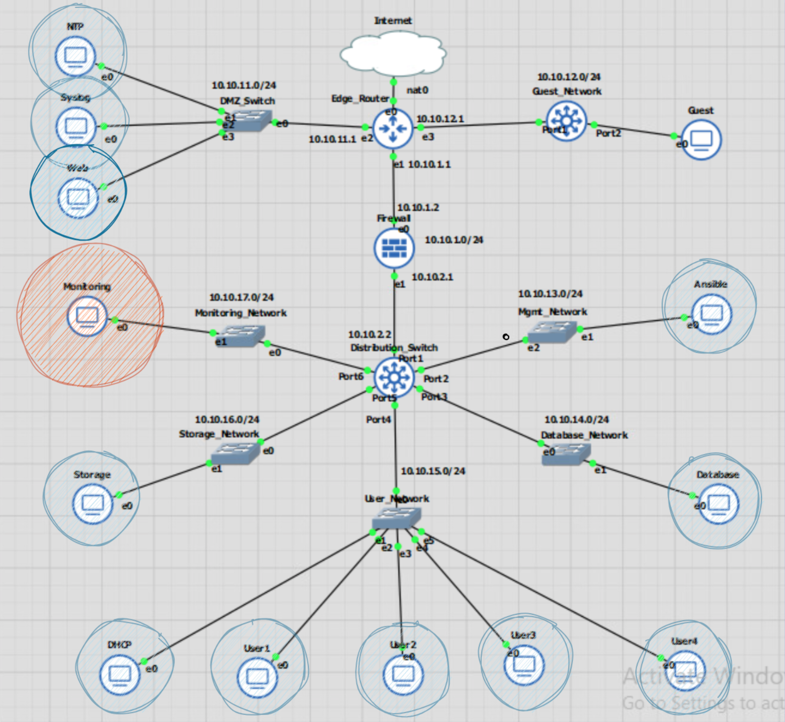
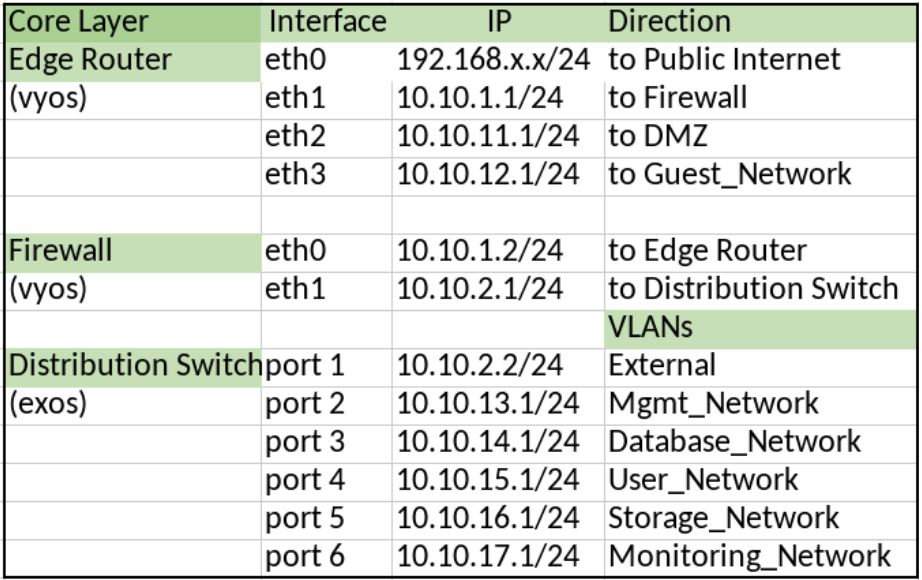
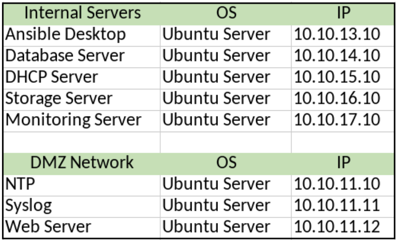
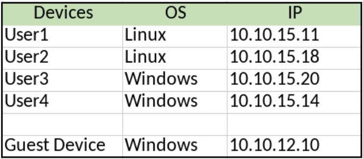
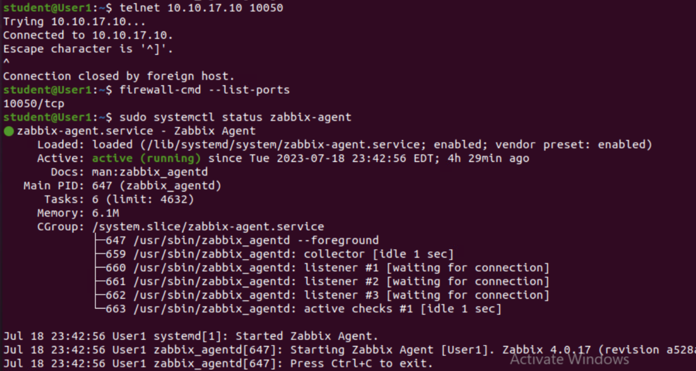
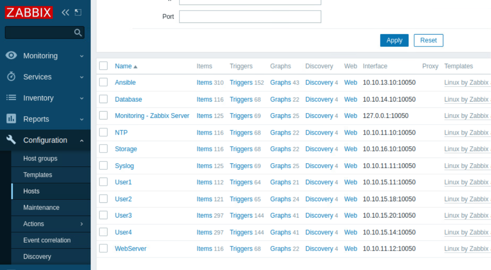
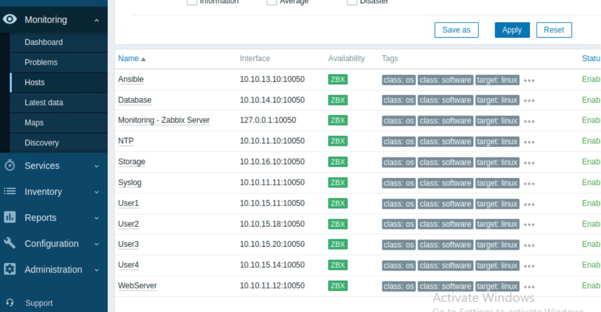
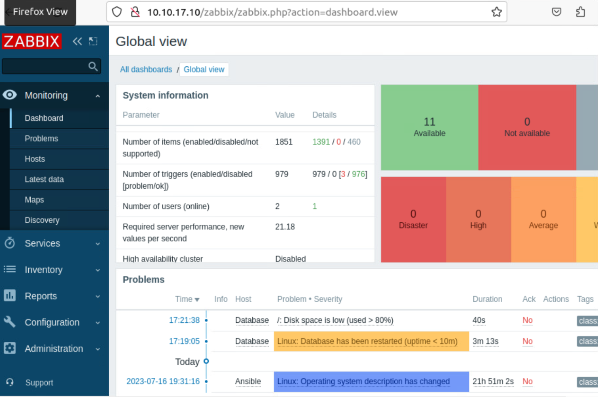

# Test Case #10: Network Security 

#### Implement a networking monitoring tool for the access layer that tracks network performance such as device statistics, link failures, high CPU utilization, or security breaches. Generate an alert for a specific event.

## Functionality
Zabbix is a monitoring tool that will track device statistics and generate alerts from the monitoring network. For devices that need to be monitored, zabbix agents will need to be installed and port 10050 enabled. 

## Network Diagram Segment
 

  

  
  
  

## Testing Method
On zabbix server, test if port 10050 is listening for agents  
`netstat –tuln | grep 10050`  

 
Check that the zabbix-agent is enabled  
`sudo systemctl status zabbix-agent`  

Telnet on port 10050 between the monitoring server and target devices to ensure agent connectivity  
`telnet <IPaddress> 10050`  

On target systems, make sure that port 10050 is enabled with firewalld  
`firewall-cmd —list-ports`  

After an agent is communicating with the monitoring server, an alert will need to be generated. Since Zabbix comes configured out of the box with default alerts, I turned off the database server, and simulated over 80% storage space on separate events. Both alerts appeared in the monitoring dashboard.  

## Process List
On the Monitoring server, 10.10.17.10, Zabbix monitoring will be installed. Documentation for installing Zabbix 6.0 can be found here:  `https://www.zabbix.com/documentation/6.0/en/manual`  
 
Use default credentials to log into the web platform:  
http://10.10.17.10/zabbix
(Admin/zabbix)  
 

Install the Zabbix agent on all target devices  
`sudo apt-get update`  
`sudo apt-get install zabbix-agent`  

  
 
`sudo nano /etc/zabbix/zabbix_agentd.conf`  

Edit Server and ServerActive IP to point to the IP address of the Zabbix server.  

`sudo systemctl restart zabbix-agent`  

  

  
Test that the zabbix agent active, port 10050 is open, and it can telnet on that port on a network device (User1)

  

  

  
Add the target device to the monitoring server under: configuration > hosts. Include a name, IP address, and port

  

  

  
Verify the agent is connected in the menu, Monitoring > hosts  and make sure the availability is green.

  

   

Generate an alert by fake allocating an additional 4GB of storage. Over 80% storage space being used should trigger it. On target device, list the disk sizes: 

`df –h`  
`fallocate -l 5G /tmp/temp.img`  
  

  
You can see an alert for restarting and low disk space.

  

  
