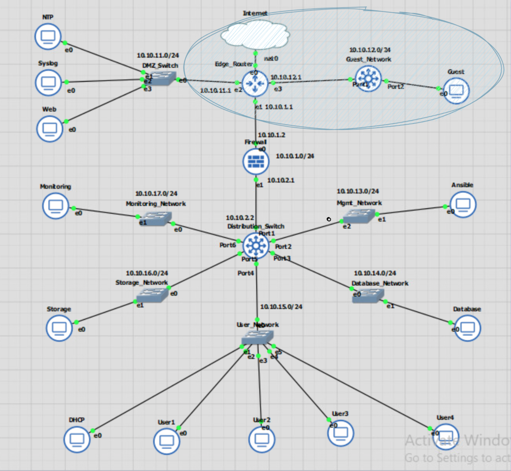
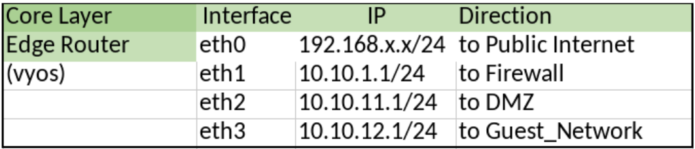
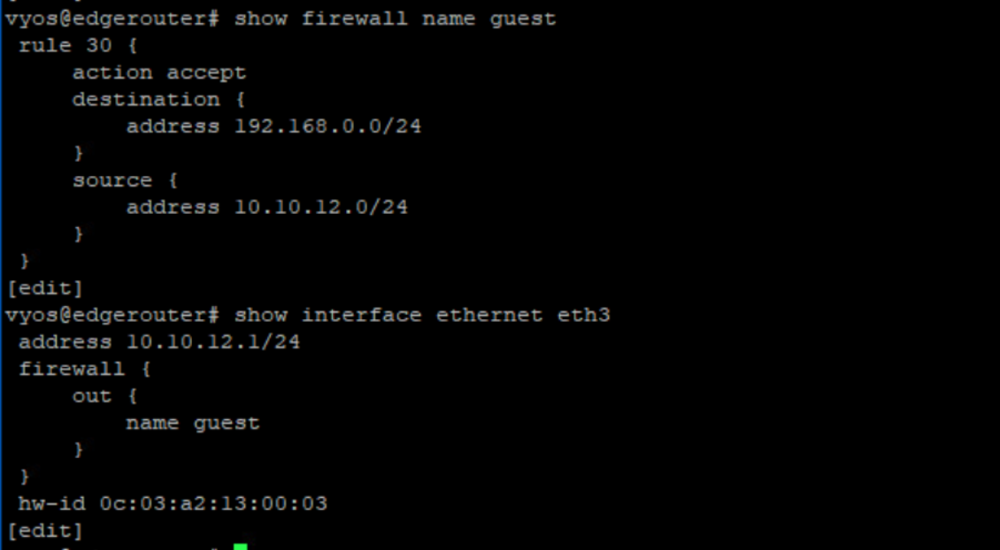
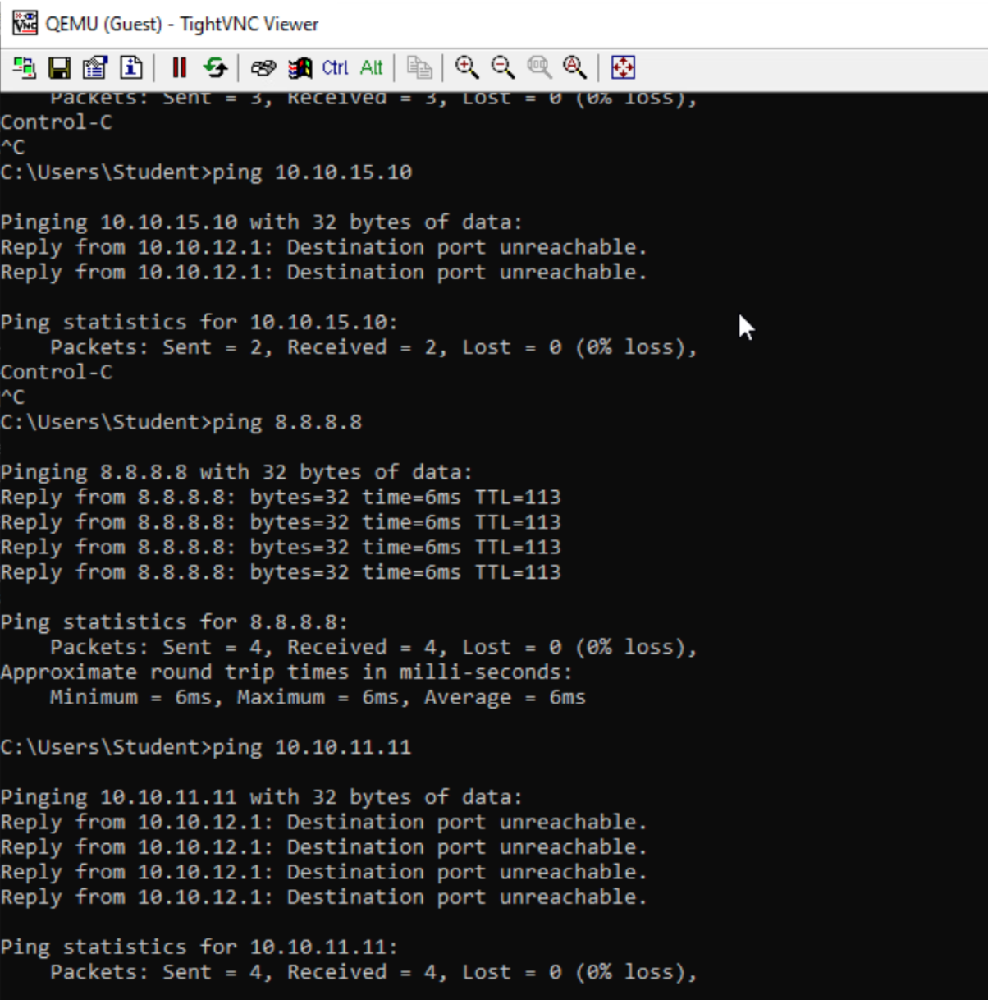

# Test Case #2: Administering an Access Control List for Guest Access 

#### Your network must utilize an Access Control List that allows guest access. Guest access should be limited to internet traffic only.

## Functionality
Guest devices in the guest network will be able to access internet traffic only. It should not have access to the internal network.

## Network Diagram Segment
 

  

  
  
 

## Testing Method
From the Guest device, ping internal networks to make sure they are not reachable. The guest device should be able to reach the external internet at 8.8.8.8  

## Process List
Create a firewall rule to allow connections from the Guest_Network to the Public Internet, on the Edge Router.  

`set firewall name guest rule 30 source address 10.10.12.0/24`  
`set firewall name guest rule 30 destination address 192.168.0.0/24`  
`set firewall name guest rule 30 action accept`  
`Set interfaces ethernet eth3 firewall out name guest`  
`commit`  
`save`  

 
`show firewall name guest` and 'show interface ethernet eth3' for the guest access list

  

   

 
Guest device can ping the public network, at 8.8.8.8, but cannot ping internal devices

  

