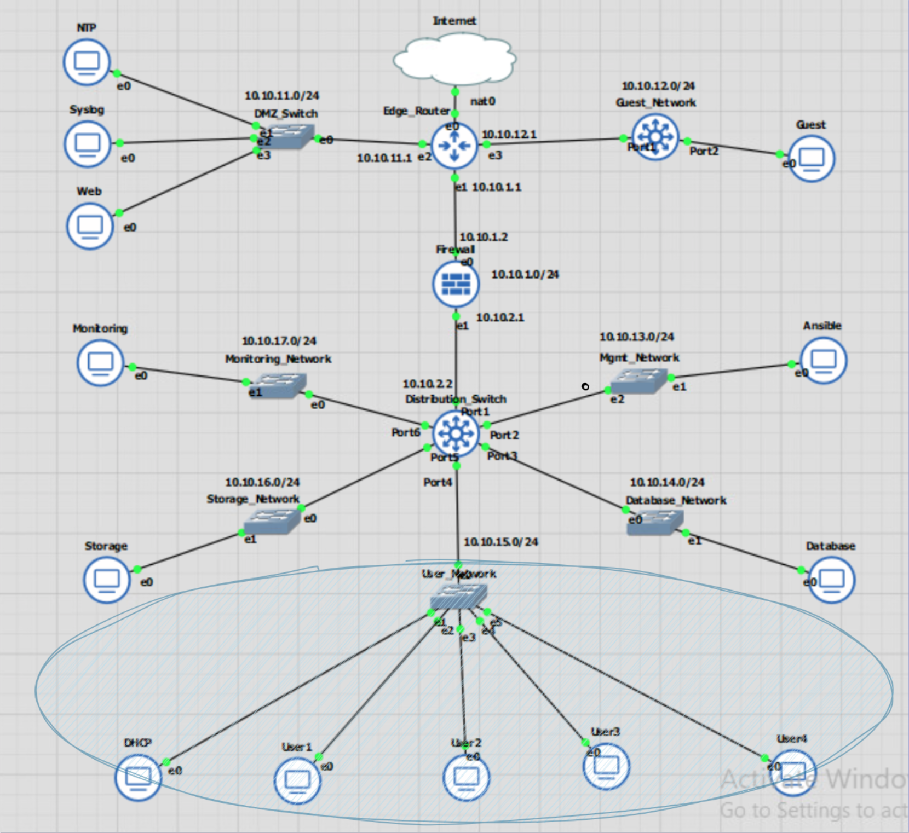
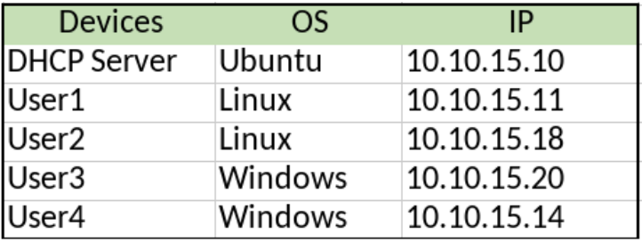
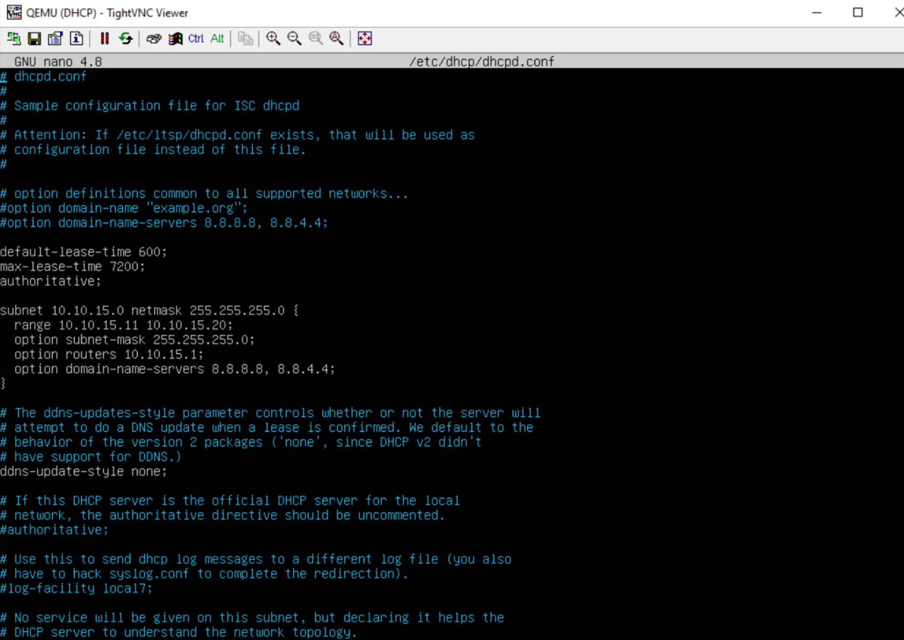
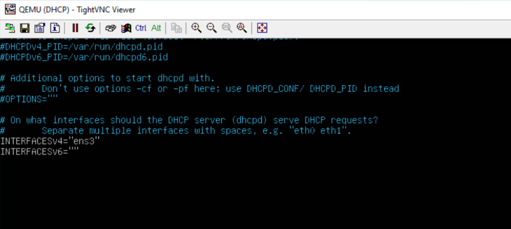
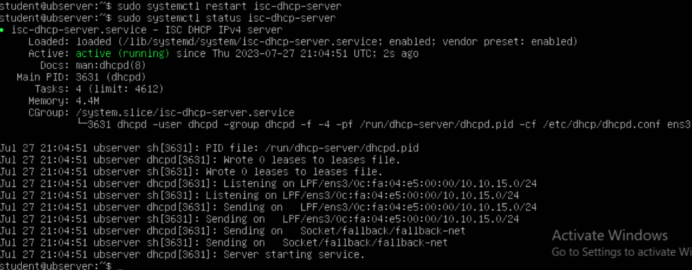
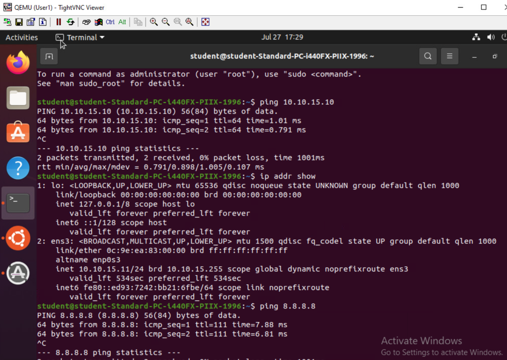
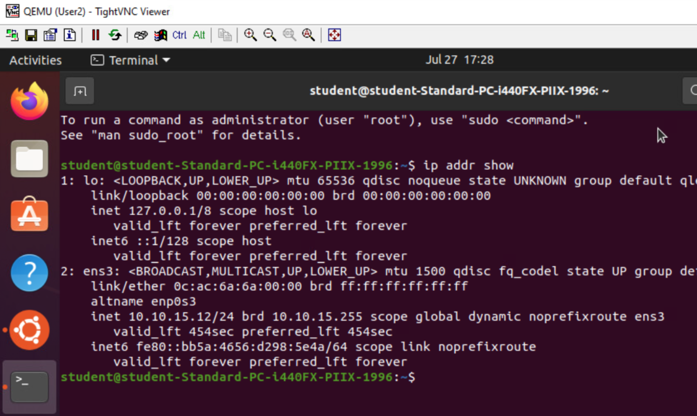
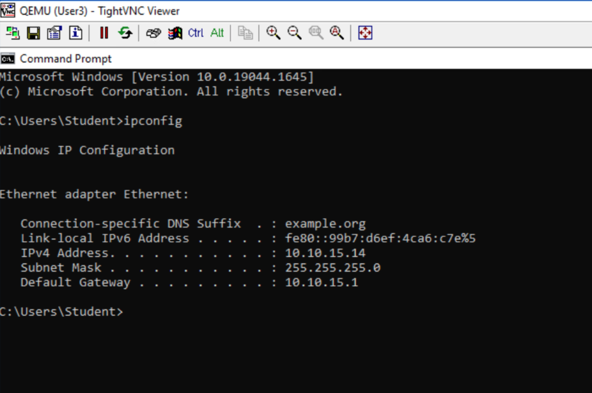
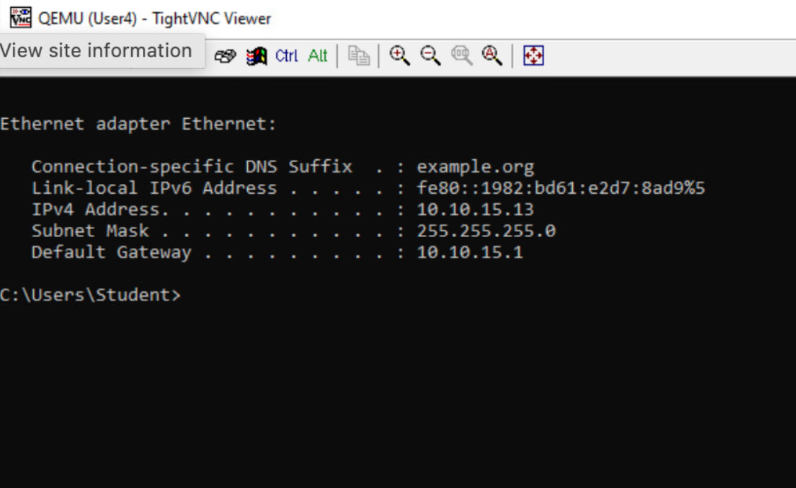

# Test Case #4: Accessing External Resources—Routing and Traffic Security 

#### User devices on your network should have dynamic addresses that are assigned through DHCP unless they provide a service that requires a static address. You must also have at least one network resource that requires a static address. 


## Functionality
The DHCP server on the User_Network has a static IP of 10.10.15.10 and is attached to the interface of a  switch (10.10.15.1) along with 4 other machines. The DHCP will dynamically assign IPs to the other machines on the same User_Network. There are 4 total user desktops; User1 and User2 are linux desktops, and User3 and User4 are Windows desktops.

## Network Diagram Segment
<br>
<div align="center">
  
</div>
<div align="center">
  
</div>

## Testing Method
Check that the status of isc-dhcp-server is up and running on the DHCP server:  
`sudo systemctl status isc-dhcp-server`  

On desktops, ip addr show for Linux Desktops or ipconfig for Windows Desktops to ensure an IP was assigned.  

On windows devices, I had to release and renew the IP when changes to the DHCP server if there was a previously assigned ip using:  
`ipconfig /release`  
`ipconfig /renew`  

Or for linux devices:  
`sudo dhclient -r ens3`  
`sudo dhclient ens3`  


## Process List
The DHCP server, along with other Ubuntu servers in this network, are assigned a static IP address with netplan.  

Open the netplan file and add the entry to configure a static IP address.  
`sudo nano /etc/netplan/01-netcfg.yaml`  
````
network:
  version: 2
  renderer: networkd
  ethernets:
    ens3:
      dhcp4: no
      addresses: [10.10.15.10/24]
      gateway4: 10.10.15.1
      nameservers:
        addresses: [8.8.8.8, 8.8.4.4]
````  
Apply the configuration.  
`sudo netplan apply`  

On the DHCP Server, install isc-dhcp-server  

`sudo apt install isc-dhcp-server`  

Open
`sudo nano /etc/dhcp/dhcpd.conf`  

And look for  
````
option domain-name "example.org";
option domain-name-servers 8.8.8.8, 8.8.4.4;

default-lease-time 600;
max-lease-time 7200;
````  

Add the below 

````
subnet 10.10.15.0 netmask 255.255.255.0 {
  range 10.10.15.11 10.10.15.20;
  option subnet-mask 255.255.255.0;
  option routers 10.10.15.1;
  option domain-name-servers 8.8.8.8, 8.8.4.4;
}
````

<div align="center">
  
</div>
<br>
<br>
Add the interface that will be auto-assigned an IP address.  

`sudo nano /etc/default/isc-dhcp-server`  
````
INTERFACESv4="ens3"
````  

<div align="center">
  
</div>
<br>
<br>

Restart the DHCP for changes to take effect.  
`sudo systemctl restart isc-dhcp-server`  

Check if the dhcp package is active.  
`sudo systemctl status isc-dhcp-server`  
<br>
<div align="center">
  
</div>
<br>
<br>

<div align="center">
 <p>User1 was assigned an IP address of 10.10.15.11/24</p>
  
</div>
<br>
<br>
<div align="center">
 <p>User2 was assigned an IP address of 10.10.15.12/24</p>
  
</div>
<br>
<br>
<div align="center">
 <p>User3 was assigned an IP address of 10.10.15.14/24</p>
  
</div>
<br>
<br>
<div align="center">
 <p>UUser4 was assigned an IP address of 10.10.15.13/24</p>
  
</div>
<br>
<br>
