# Test Case #6: Edge Device Syslog and NTP 

#### Configure perimeter devices to generate system logs that capture unwanted traffic. Additionally, those perimeter devices should utilize Network Time Protocol (NTP) for clock synchronization. 


## Functionality
 The edge router and firewall are the edge devices that will configured to send syslogs to a centralized syslog server. The syslog server IP is 10.10.11.11

The edge router and firewall will be configured to use the NTP server with IP 10.10.11.10

 
## Network Diagram Segment
<br>
<div align="center">
  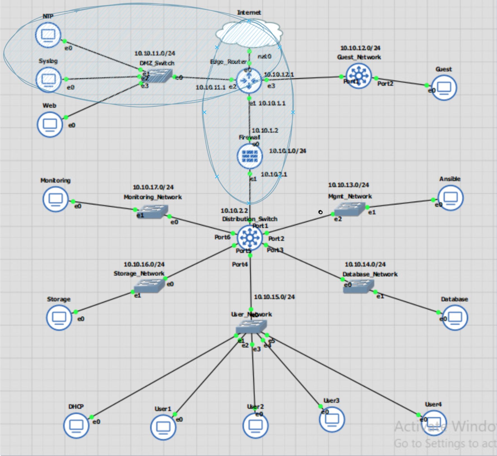
</div>
<div align="center">
  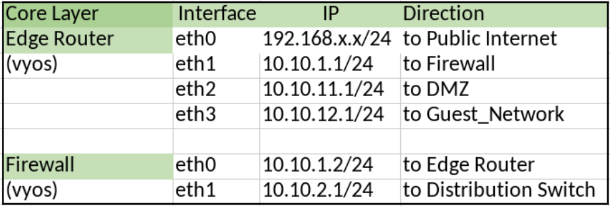
  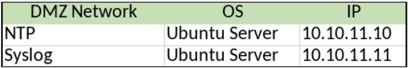
</div>

## Testing Method

### Syslog
Check if the syslog server is active  
`Systemctl status rsyslog`  

Check if syslog is listening on the correct ports  
`netstat -4altunp | grep 514`  

Check if the folder has proper permissions to be written, so syslog files can be created on the syslog server  
`ls –ld /var/log/remote`  

Check if there are any errors with syntax in the conf file  
`rsyslogd -f /etc/rsyslog.conf -N1`  

On client, verify that syslog has been configured  
`show system syslog host`  


### NTP

Verify the NTP status is ‘active’ on the NTP server, and the list of NTP servers have IP addresses.
service NTP status  
`ntpq -p` 
 
Verify the NTP service is ‘active’ on NTP clients, edgerouter and firewall  
`sudo service ntp status`  

Check if ntp is in INIT,  STEP, or <ip> stage under refid. The NTP service should synchronize and show and <IP> if properly configured.  
`Show NTP`  
<br>

## Process List
Install rsyslog on the syslog server:  
`sudo apt-get install rsyslog`  

`sudo nano /etc/rsyslog.conf`  

Uncomment the below to enable port 514  
````
module(load="imudp")
input(type="imudp" port="514")
````

Add the templates for the log folder for both the edge router and firewall
````
$AllowedSender UDP, 127.0.0.1, 10.10.11.1, 10.10.1.2

$template edgerouter, "/var/log/remote/edgerouter.log"
if $fromhost-ip == '10.10.11.1' then ?edgerouter
& ~

$template firewall, "/var/log/remote/firewall.log"
if $fromhost-ip == '10.10.1.2' then ?firewall
& ~
````

<div align="center">
  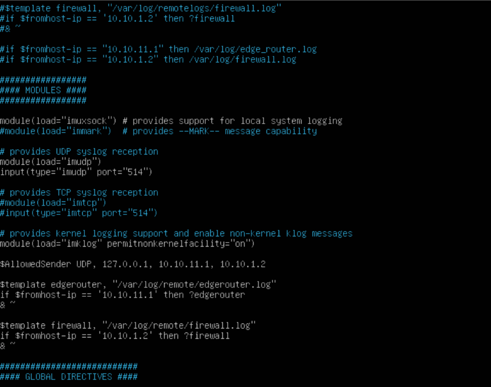
</div>
<br><br>

Allow port 514 in the firewall, or use ports.yaml in /home/student/ansible to enable 514/udp  

`sudo ufw allow 514/udp`  
`sudo service rsyslog restart`  


Create the log folder directory on the Syslog server. Enable write permissions, either 755,766, or 777 permissions, and verify.  

`sudo mkdir /var/log/remote`  
`sudo chmod 755 /var/log/remote
ls –ld /var/log/remote`  
<br>
<div align="center">
 <p>Test cases show there are no errors in /etc/syslog.conf, the rsyslog status is active, syslog is listening on port 514, and the syslogs files were created from the edge router and firewall.</p>
  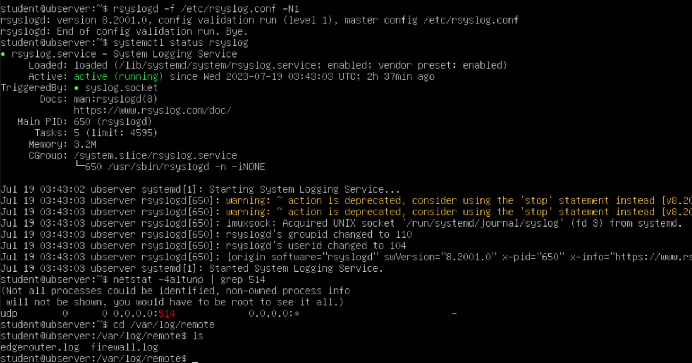
</div>
<br>
<br>


Configure the edgerouter and firewalls to set a remote syslog host, with desired severity levels.  

`configure`  
`set system syslog host 10.10.11.11 facility syslog level info`  
`set system syslog host 10.10.11.11 facility syslog protocol udp`  
`set system syslog host 10.10.11.11 facility all level notice`  
`set system syslog host 10.10.11.11 facility all protocol udp`  
`commit`  
`save`  

Confirm the syslog host has been configured on the edge router and firewall with  
`show system syslog host`  

<div align="center">
 <p>‘show system syslog host’ on the edge router</p>
  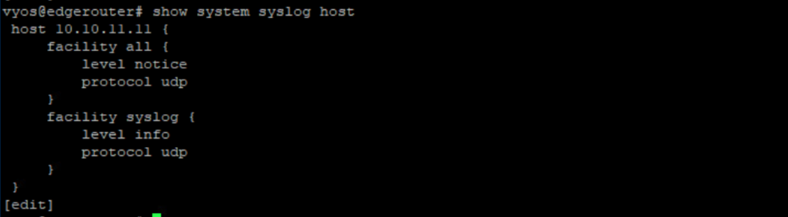
</div>
<br><br>
<div align="center">
 <p>‘show system syslog host’ on the firewall</p>
  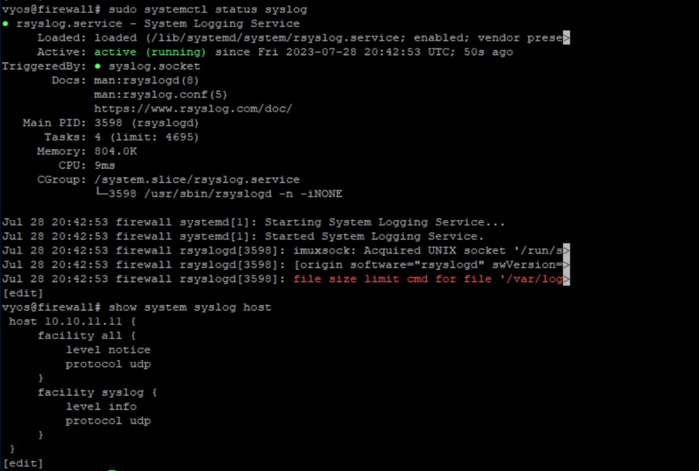
</div>
<br><br>
<div align="center">
 <p>Contents of edgrouter.log in /var/log/remote on the syslog folder</p>
  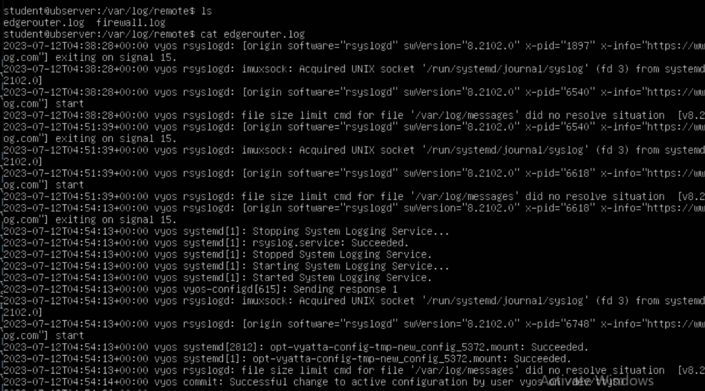
</div>
<br><br>
<div align="center">
 <p>Contents of firewall.log in /var/log/remote on the syslog folder</p>
  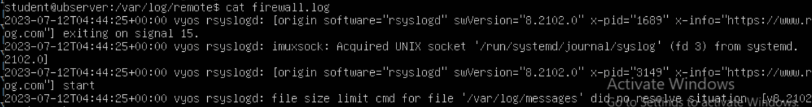
</div>
<br><br>

Configure NTP Server  
`sudo apt update`  
`sudo apt install ntp`  

Open the ntp.conf file and edit default server pools.  

`sudo nano /etc/ntp.conf`  

 In this case I ucommented the default pools  
 ````
server 0.pool.ntp.org
server 1.pool.ntp.org
server 2.pool.ntp.org
````

 And added
 ````
server 0.us.pool.ntp.org
server 1.us.pool.ntp.org
server 2.us.pool.ntp.org
server 3.us.pool.ntp.org
````

<div align="center">
  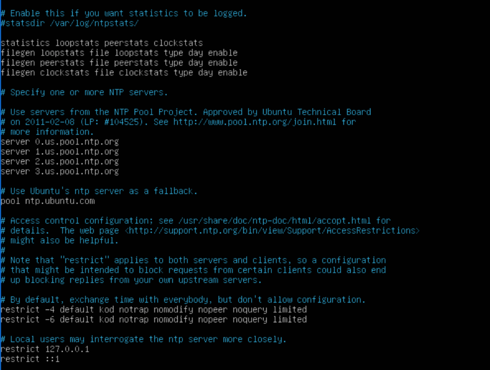
</div>
<br>
<br>

Restart service for the changes to take effect:  
`sudo systemctl restart ntp`  
<br>

<div align="center">
 <p>Verify  the NTP server is properly running with ‘service NTP status’ and ‘ntpq –p’</p>
  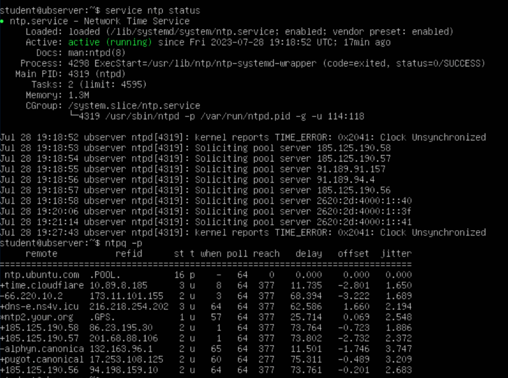
</div>
<br>
<br>

Configure NTP clients (edgerouter and firewall) to use the NTP server  
`config`  
`set system ntp server 10.10.11.10`  
`commit`  
`save`  

Test that the ntp service is running with `sudo service ntp status` and `show ntp` 


<div align="center">
 <p>NTP service is configured on the edge router</p>
  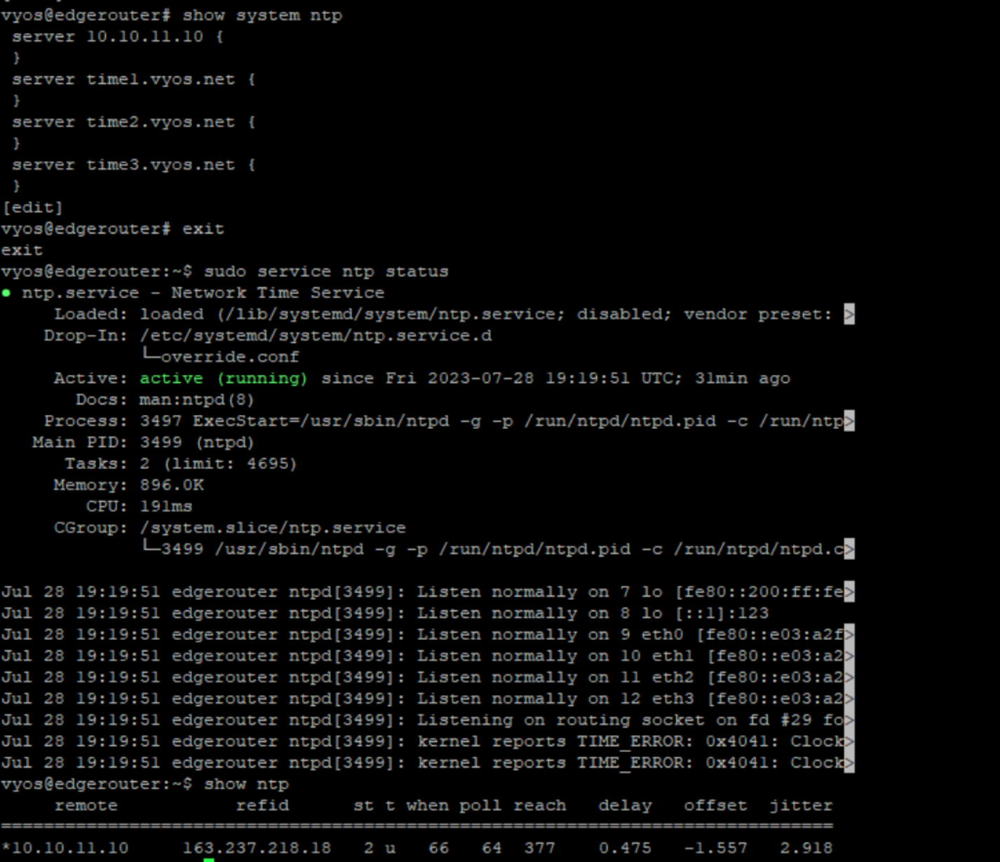
</div>
<br>
<br>

<div align="center">
 <p>NTP service is configured on the firewall</p>
  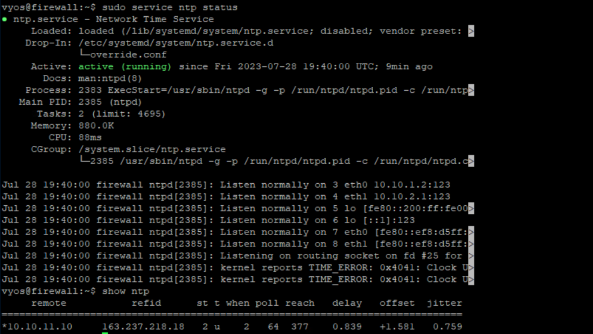
</div>
<br>
<br>

