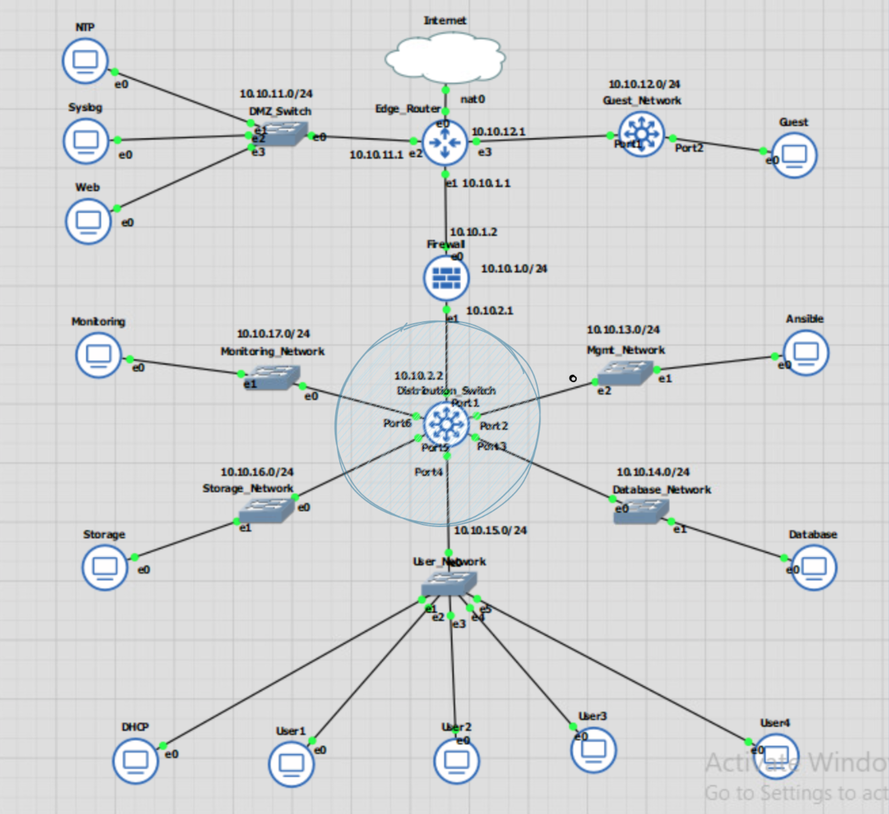
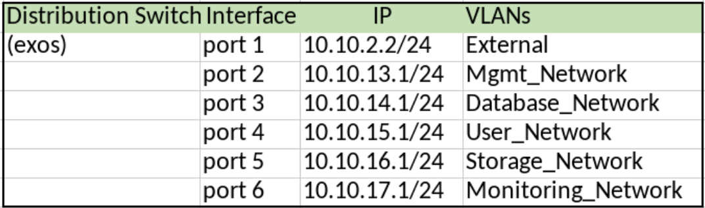
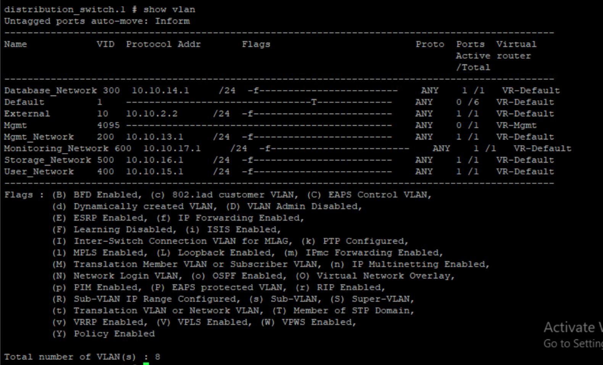
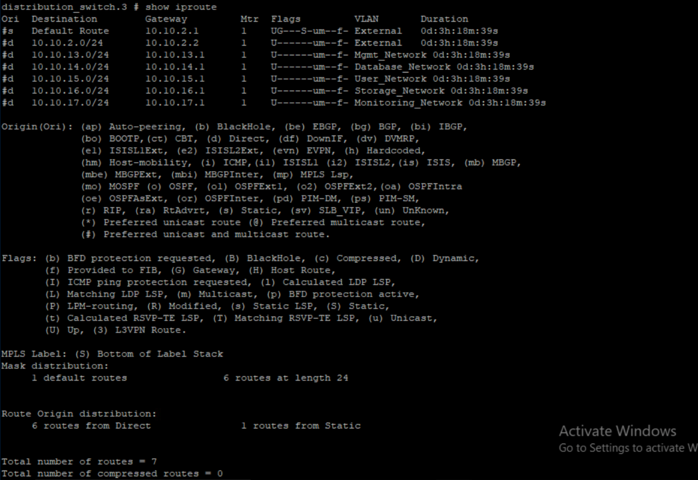
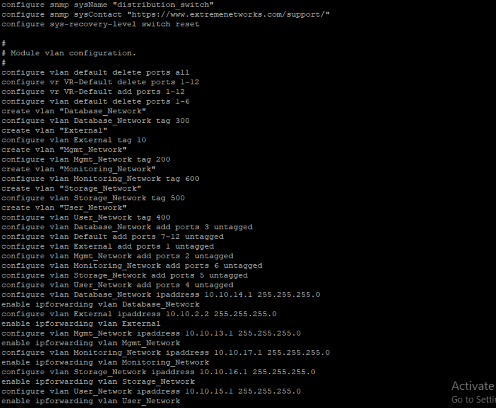
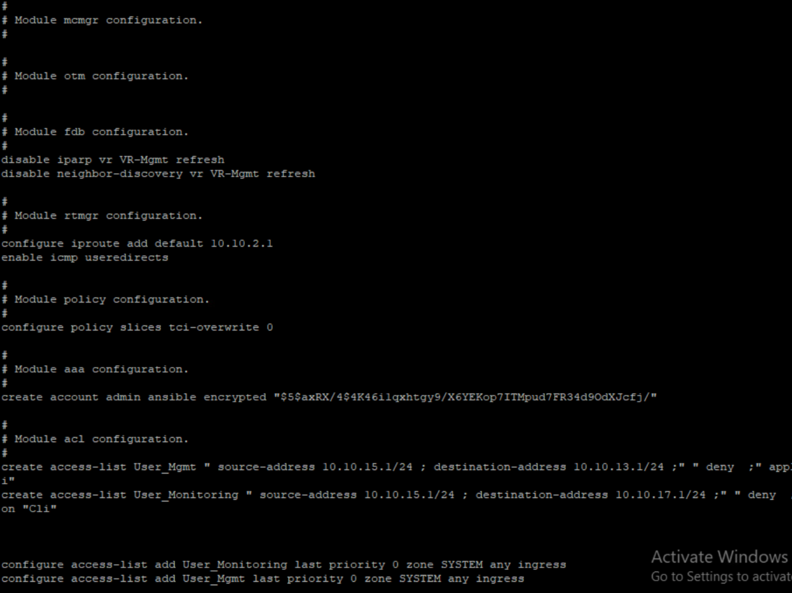
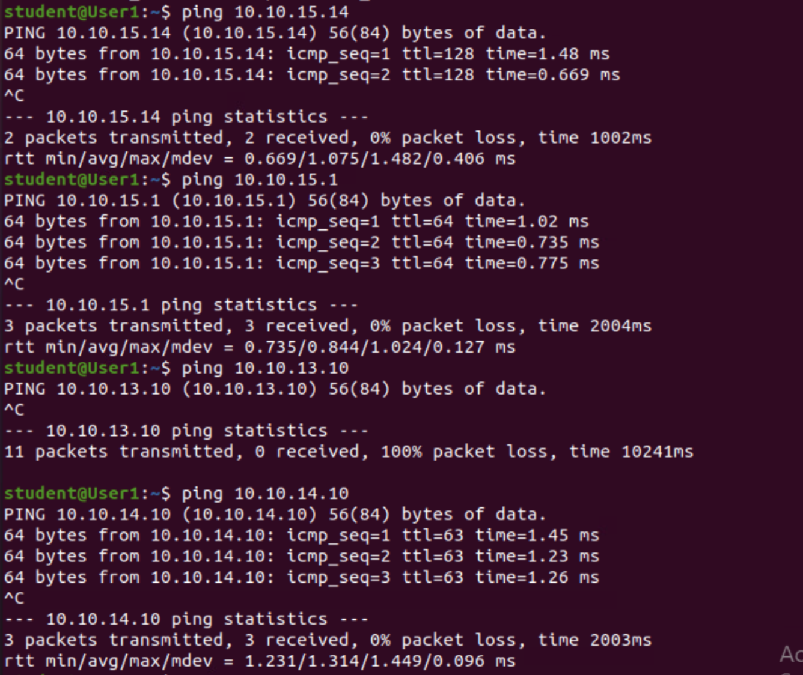

# Test Case #7: Basic Network Segmentation at Layer 2 via VLANs and 802.1q 

#### Your network traffic should be segmented per department or service function at Layer 2 to enhance security and reduce network congestion at the switching layer while allowing segmented traffic to traverse between switches (VLAN trunking).  

## Functionality
 The distribution switch handles routing between VLANS on the internal network. A VLAN must be configured for each interface that handles a network. And then the VLANS need to be configured to communicate with each other.  

## Network Diagram Segment
 

  

  

## Testing Method
Intervlan connectivity is tested by pinging a device on another VLAN. Ping other interfaces, ping other devices, and run a Wireshark capture if the ping fails.  

If the device on the VLAN can communicate with the interface, then the VLAN is properly configured.  
If the device can communicate with a device on another VLAN, then ipforwarding is enabled.  

`show vlan`  

`show iproute`  

`show configuration`  

## Process List
On the switch:  

`create vlan External`  
`configure vlan External tag 10`  
`configure vlan External add port 1 untagged`  
`configure vlan External ipaddress 10.10.2.2/24`  

`create vlan Mgmt_Network`  
`configure vlan Mgmt_Network tag 200`  
`configure vlan Mgmt_Network add port 2 untagged`  
`configure vlan Mgmt_Network ipaddress 10.10.13.1/24`  

`create vlan Database_Network`  
`configure vlan Database_Network tag 300`  
`configure vlan Database_Network add port 3 untagged`  
`configure vlan Database_Network ipaddress 10.10.14.1/24`  

`create vlan User_Network`  
`configure vlan User_Network tag 400`  
`configure vlan User_Network add port 4 untagged`  
`c1onfigure vlan User_Network ipaddress 10.10.15.1/24`  

`create vlan Storage_Network`  
`configure vlan Storage_Network tag 500`  
`configure vlan Storage_Network add port 5 untagged`  
`configure vlan Storage_Network ipaddress 10.10.16.1/24`  

`create vlan Monitoring_Network`  
`configure vlan Monitoring_Network tag 600`  
`configure vlan Monitoring_Network add port 6 untagged`  
`configure vlan Monitoring_Network ipaddress 10.10.17.1/24`  

`add a default route through the firewall interface`  
`configure iproute add default 10.10.2.1`  

`enable ipforwarding between the VLANsEnable ipforwarding vlan 200-600`  
`enable ipforwarding vlan 10`  
  

 
show vlan

  

  

 
show iproute

  

  

 
show config

  
  

  

 
Ping devices across other VLANs to ensure connectivity

  

  
