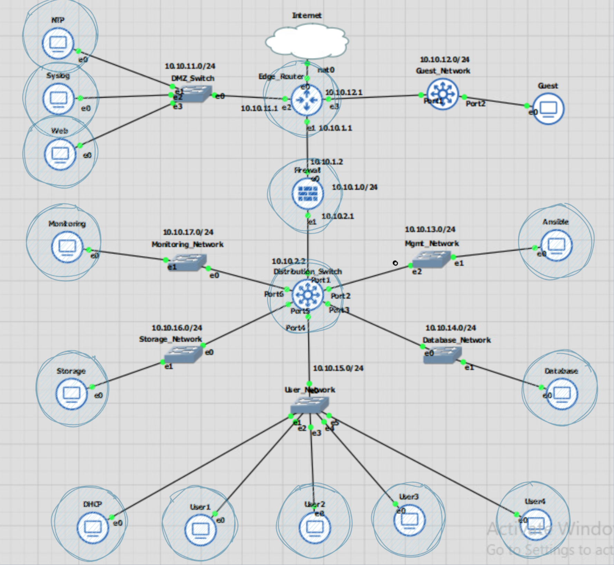
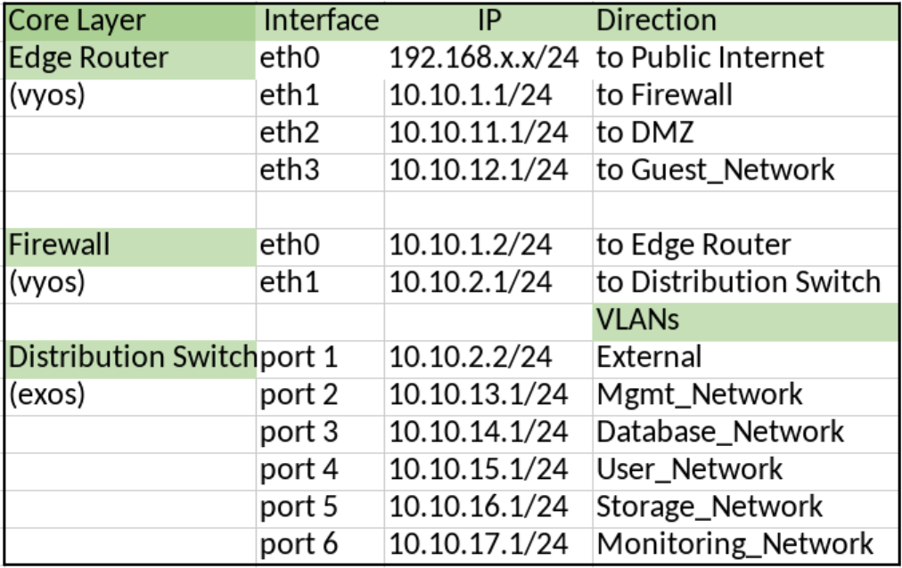
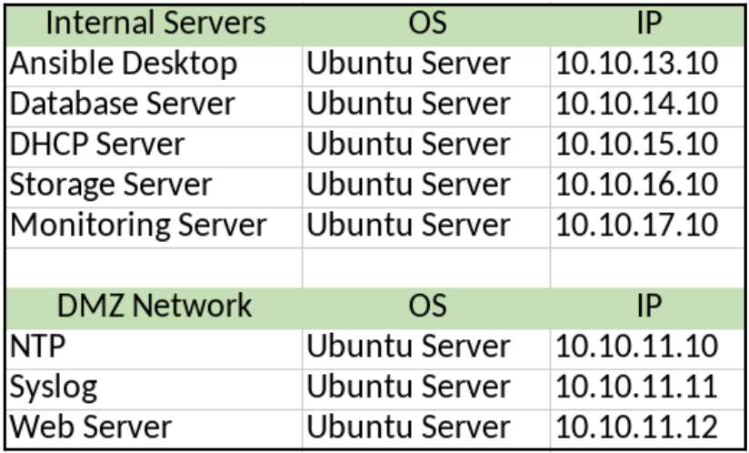
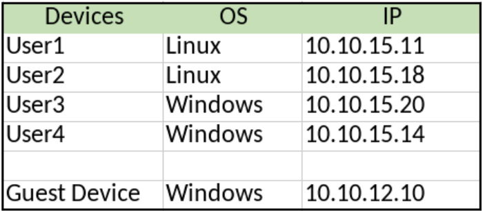
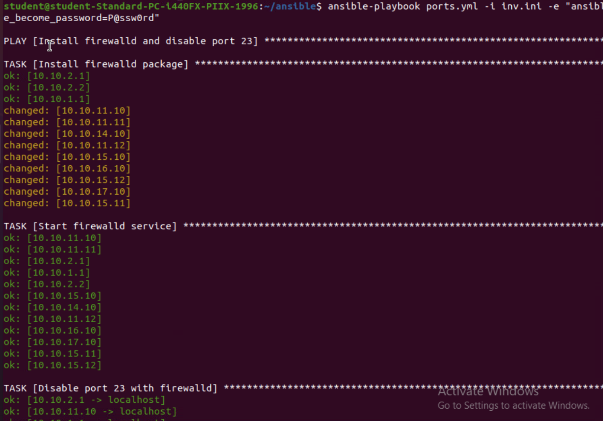
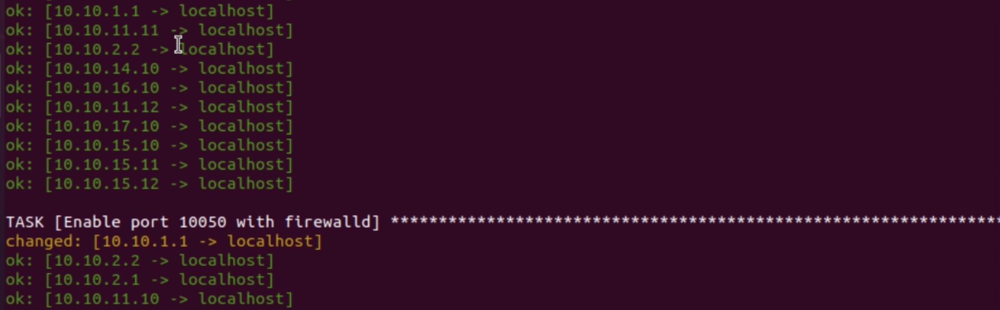
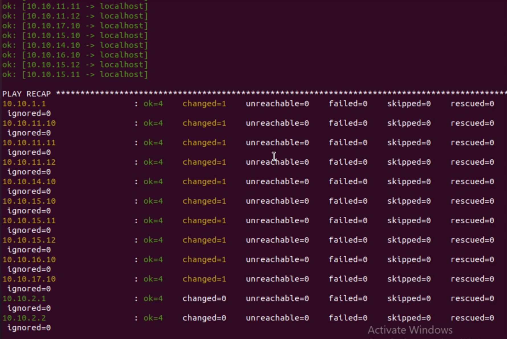
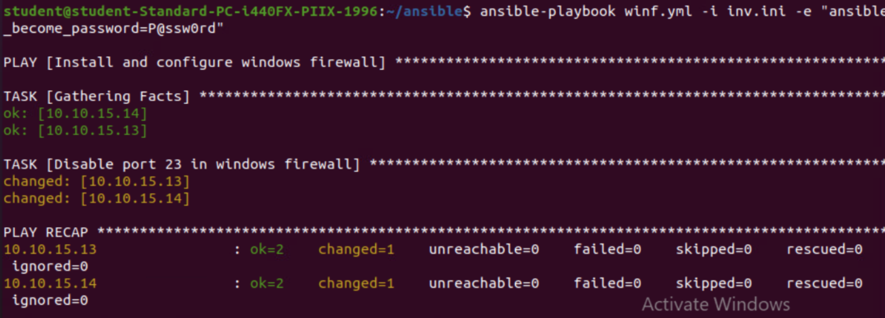
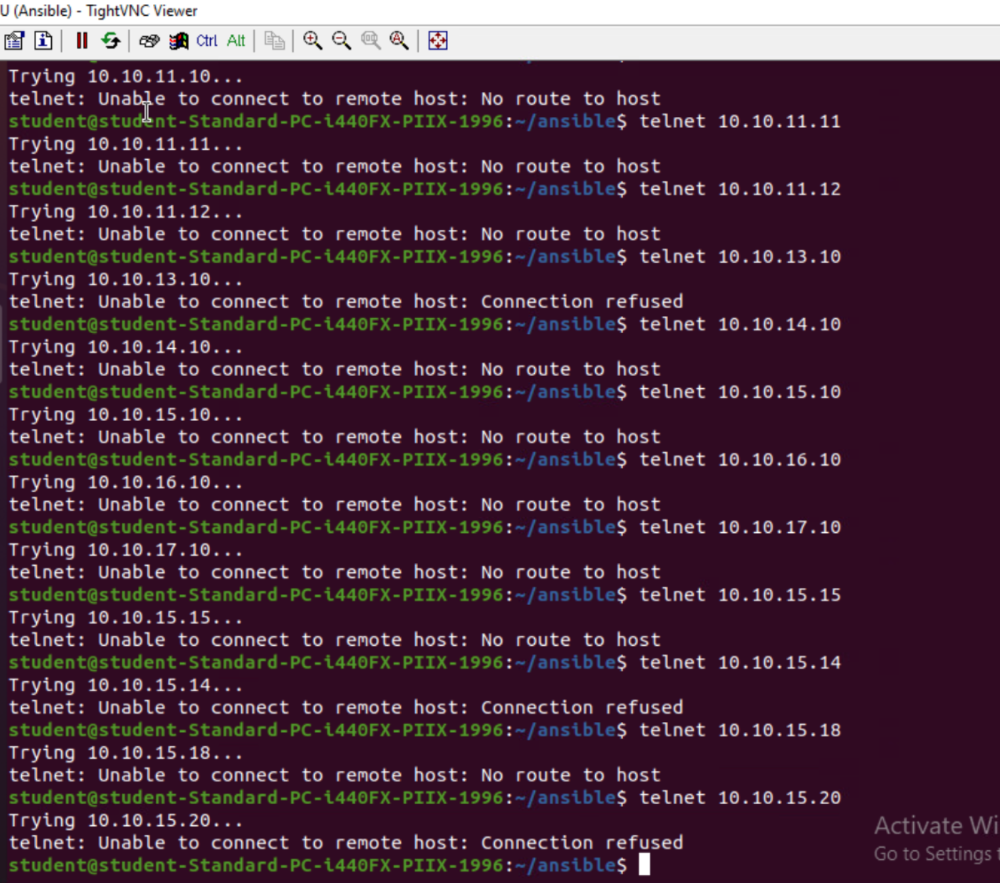

# Test Case #8: Basic or Advanced Networking 

#### Identify devices on the network that allow for unsecured ports (port 23). Ensure that telnet is blocked if the port is open.

## Functionality
Firewalld will be used to ensure that port 23 (telnet) is disabled on each device, and Ansible will be the tool for orchestrating configurations across all devices on the network. Windows devices will use a separate windows playbook.  

Since firewalld can easily disable or enable ports, I will also open port 10050 to be used for Zabbiz Agent communication for case #10.  

## Network Diagram Segment
 

  

  
  
  
 

## Testing Method
1. Telnet to devices listed in the inventory file to check that it is blocked. Telnet uses port 23 and should not be able to connect after the playbook is applied.  

   `telnet <ip>`   or  `telnet <ip> 23`  

3. Another method is to use nmap to scan if an IP address has port 23 open from the ansible desktop.  

    First install nmap  
      `sudo apt install nmap`  

    Then run command  
   `sudo nmap –p 23 <ip>`  

## Process List
Use the inv.ini, ports.yml, and winf.yml files in the GitLab repository.   

On ansible desktop, install firewalld.  
  `sudo apt-get install firewalld`

  `ansible-playbook ports.yml –i inv.ini –e “ansible_become_user=P@ssw0rd”`  
  

  
  
  

  

For windows devices:  
`ansible-playbook winf.yml –i inv.ini –e “ansible_become_password=P@ssw0rd”`  

  

  

I was also able to run both playbooks at the same time with the following command:  

`ansible-playbook port23.yml winf.yml –i inv.ini –e “ansible_become_password=P@ssw0rd”`  
    

To confirm port 23 is closed:  

  
Results of using telnet from the Ansible Desktop show that port 23 is blocked on the internal devices as it is unable to connect to the remote host.

  

  

  
Results of the nmap scan from the ansible desktop show that port 23 is disabled across the devices in the ansible inventory.

  

  
